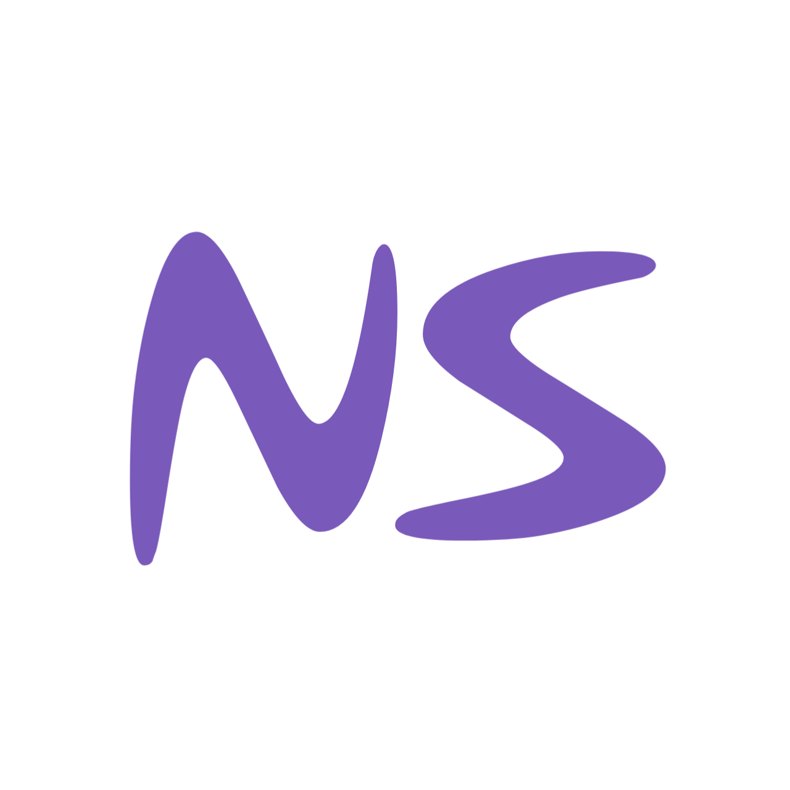

<div align="center">
  
</div>

<div align="center">
  
  
  
  
</div>

<br />

<div align="center">
  <h3>Portofolio profesional, dinamis, dan premium yang dibangun dengan teknologi web modern.</h3>
  <p>Menampilkan karya-karya terbaik dari Graphic Design, VFX, UI/UX, dan 3D Render dengan performa maksimal dan animasi interaktif.</p>
</div>

---

## 🚀 Fitur Utama

- **Desain Premium & Glassmorphism:** Antarmuka gelap dan elegan dengan efek *blur* transparan yang modern.
- **Micro-Animations & Partikel:** Efek cursor interaktif, animasi *scroll*, dan partikel yang merespons pergerakan secara "smooth".
- **Sistem Galeri Cerdas:** Galeri dan filter auto-generate berbasis folder, memudahkan pengelolaan konten skala besar.
- **Proteksi Media:** Pencegahan *Right-Click*, *Drag-and-Drop*, dan penonaktifan *Inspect Element* untuk menjaga integritas karya dan keamanan aset.
- **Responsif 100%:** Penyesuaian antarmuka presisi untuk *Desktop*, *Tablet*, dan *Mobile*.

## 🛠️ Teknologi yang Digunakan

- **Frontend:** React 19 + TypeScript
- **Bundler:** Vite
- **Styling:** Tailwind CSS (v4) & Vanilla CSS
- **Animasi:** Motion (Framer Motion)
- **Ikon:** Lucide React
- **Deployment:** Netlify
- **Otomatisasi Data:** Node.js Script (`generate_data.cjs`)

## 💻 Panduan Instalasi Lokal

Untuk menjalankan portofolio ini secara lokal, ikuti instruksi berikut:

1. **Clone repository ini**
   ```bash
   git clone https://github.com/zero0-sys/naufalstudio.git
   cd naufalstudio
   ```

2. **Instal dependensi**
   Pastikan Anda sudah menginstal Node.js, lalu jalankan:
   ```bash
   npm install
   ```

3. **Jalankan Developer Server**
   ```bash
   npm run dev
   ```
   *Buka `http://localhost:5173` di browser Anda.*

## 📂 Manajemen Data Galeri

Situs ini tidak menggunakan database eksternal terpisah. Media dirender secara otomatis berdasarkan file di dalam direktori `public/galery/`. 

Setiap kali Anda menaruh file video, foto, resolusi tinggi, documetn baru — jalankan skrip berikut di terminal untuk memperbarui `src/data.json`:
```bash
node generate_data.cjs
```

## 📜 Lisensi & Properti

**TERDAFTAR & DILINDUNGI HAK CIPTA (ALL RIGHTS RESERVED).**

Kode sumber, desain antarmuka, tata letak visual, gambar, proyek seni, identitas visual, serta semua aset dalam repositori ini adalah properti eksklusif dari **NaufalStudio / Frosnetyc**. 

Anda **TIDAK DIIZINKAN** untuk menyalin, memperbanyak, mendistribusikan ulang, memodifikasi, mem-fork untuk publikasi mandiri, atau menggunakan kode/desain situs ini demi keperluan komersial, non-komersial, dan akademis **tanpa izin tertulis** dari pemegang hak cipta. 

Pelanggaran terhadap lisensi ini (seperti mengkloning kode antarmuka kami untuk dijual kembali atau dikomersialisasi ke pihak ketiga untuk kepentingan instansi/perusahaan Anda) akan berdampak pada **tuntutan hukum dan kewajiban kompensasi/pembayaran royalti penuh**. 

Untuk bernegosiasi membeli lisensi komersial dari karya sumber ini, silakan hubungi kontak NaufalStudio. Baca selengkapnya pada file [LICENSE](./LICENSE).

<p align="center">
  <br>
  <b>NaufalStudio ❤️ Didedikasikan untuk Keindahan Karya Visual.</b>
</p>
